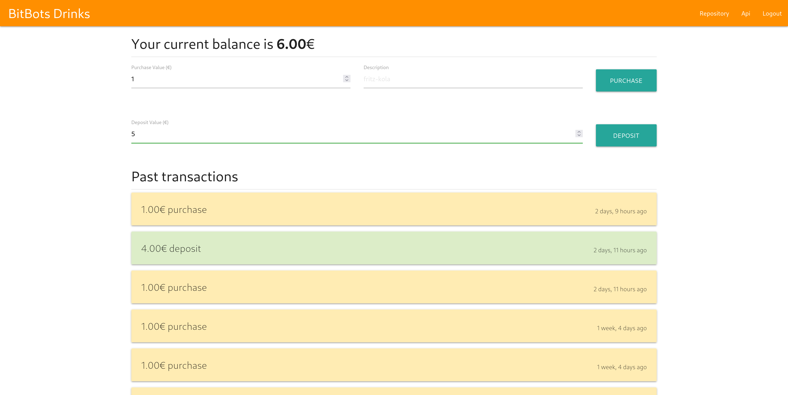

# vinywaji

> Keep track of how many drinks people have bought

Vinywaji is Swahili for "drinks".



## Deployment

This application can be deployed using two different methods which are described in the following sections.

In all cases, the application will not immediately start without errors because it needs to be configured first.
This is done via environment variables.
See [Configuration](#configuration) for the list of available options.

### On Docker

A docker image is built automatically that follows the master branch of the repository.
It is available as `ghcr.io/fsinfuhh/vinywaji:dev-latest`.

Simply start it via

```shell
docker run --name vinywaji ghcr.io/fsinfuhh/vinywaji:latest
```

Configuration can be specified by supplying environment variables during `docker run` with the `-e` argument.
I.e. `docker run -e VW_SECRET_KEY=foobar123 …`.

### On Baremetal from source

*Although this deployment works, it is not recommended. If you need to use a deployment without containers, you should
serve this application via uwsgi, gunicorn or the like.*

To build the application from source, follow the following steps:

```shell
# get the code
git clone https://github.com/fsinfuhh/vinywaji.git
cd vinywaji

# install locked python dependencies
pipenv install --ignore-pipfile
```

To start it:

```shell
pipenv shell
./src/manage.py check --deploy
./src/manage.py migrate
./src/manage.py
```

## Configuration

The application is configured at runtime via the following environment variables:

| Name                    | Default                | Description                                                                                                                   | Notes                                                                               |
|-------------------------|------------------------|-------------------------------------------------------------------------------------------------------------------------------|-------------------------------------------------------------------------------------|
| VW_DB                   | *required*             | Url that specifies the complete database connection. [Documentation](https://pypi.org/project/dj-database-url/)               | In container based deployments this preconfigured to point to `/app/data/db.sqlite` |
| VW_SECRET_KEY           | *required*             | Django secret key. **Keep this secret!**                                                                                      |                                                                                     |
| VW_ALLOWED_HOSTS        | *required*             | List of hostnames which may be used when accessing the application.                                                           |                                                                                     |
| VW_SERVED_OVER_HTTPS    | `false`                | Whether the application is served over HTTPS. If enabled, automatic redirects and additional security measures are activated. |                                                                                     |
| VW_HSTS_SECONDS         | `63072000`             | If larger than 0 and `BL_SERVED_OVER_HTTPS` is true, HSTS is enabled with this configured value.                              |                                                                                     |
| VW_TRUST_REVERSE_PROXY  | `false`                | If true, headers set by a reverse proxy (i.e. `X-Forwarded-Proto`) are trusted.                                               |                                                                                     |
| VW_OPENID_PROVIDER_NAME | `Mafiasi`              | A human readable name identifying the authentication provider.                                                                |                                                                                     |
| VW_OPENID_ISSUER        | *mafiasi-identity*     | The url of the openid issue                                                                                                   |                                                                                     |
| VW_OPENID_CLIENT_ID     | *required*             | Mafiasi-Identity client ID. Used for authentication                                                                           |                                                                                     |
| VW_OPENID_CLIENT_SECRET | *required*             | Mafiasi-Identity client secret. Used for authentication                                                                       |                                                                                     |
| VW_ALLOWED_METRICS_NETS | `127.0.0.0/8`, `::/64` | List of IP networks which are allowed to access the /metrics endpoint                                                         |                                                                                     |
| VW_ORG_NAME             | `Bit-Bots Drinks`      | Application Title related to the organisation that hosts it                                                                   |                                                                                     |
| VW_DEFAULT_AMOUNT       | `1.5`                  | A float describing how much a drink costs per default                                                                         |                                                                                     |
| VW_MAFIASI_COLORS       | `false`                | Whether a color scheme specific to Mafiasi should be used                                                                     |                                                                                     |
